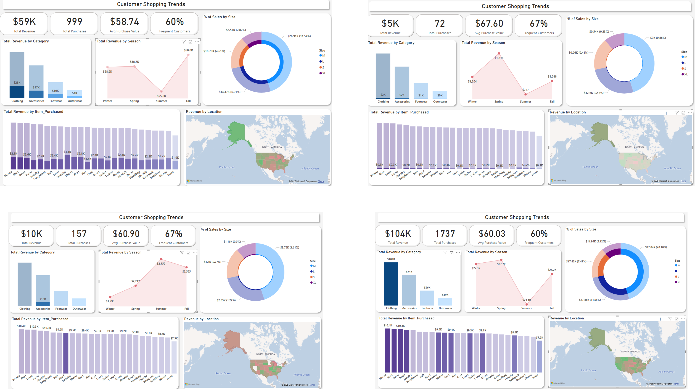
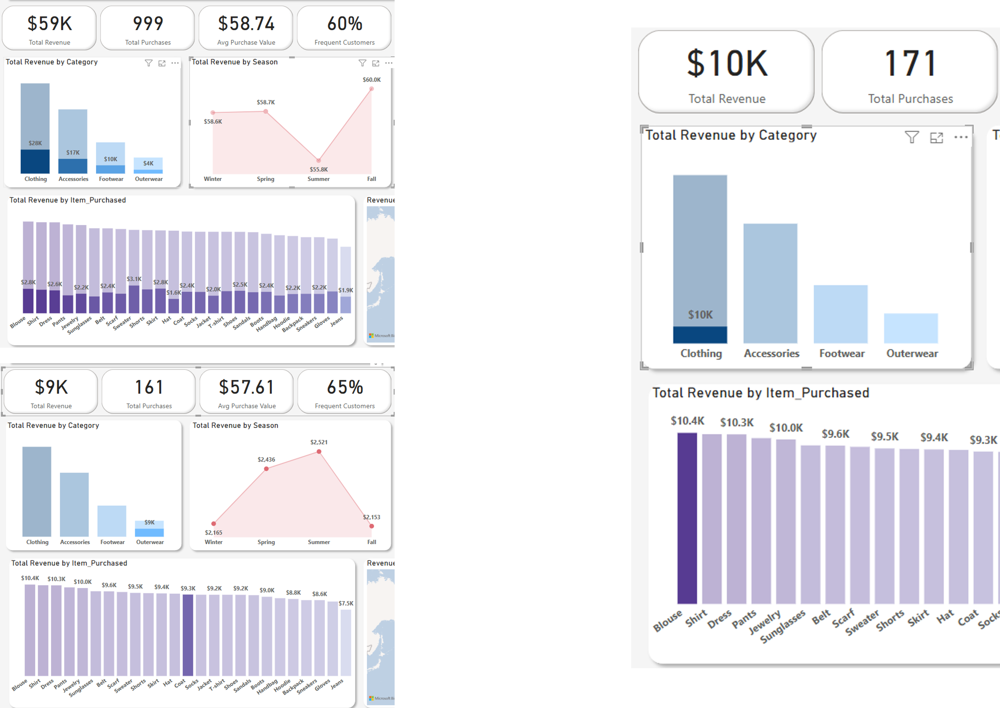
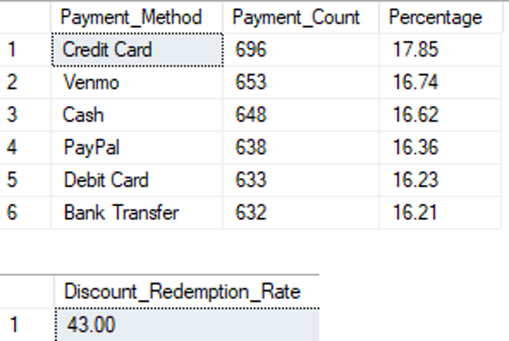

# **Customer Shopping Trends Analysis Using SQL & Power BI**  

## **Project Overview**  
This project analyzes consumer shopping trends using a dataset containing transactional data across various product categories, customer demographics, and purchase behaviors. The goal is to uncover insights into purchasing patterns, seasonal trends, and customer preferences using SQL and Power BI.  

## **Data Sources**  
The dataset includes:  
- **Transaction Details**: transaction value, category, payment method, ...
- **Customer Information**: Age, gender, location, ...
- **Shopping Behavior**: Purchase frequency, average spend, seasonal trends, ...

## **Key KPIs**  
1. **Total Revenue Analysis**  
   - By Location, Category, Item, and Season
2. **Average Transaction Value (ATV)**
3. **Total Purchases by Item**
4. **Top-Selling Items by Season**
5. **Percentage of sales by size**
6. **Payment Method Distribution** (Not shown on dashboard)
7. **Discount Redemption Rate** (Not shown on dashboard)

### **Revenue - % of sales by size**

### **ATV - Total Purchases by Item - Top-Selling Items by Season**

KPI's 5 and 6 were not shown on dashboard due to page being filled with other visualizations, thus, they will be continued on page 2, with maybe more KPI's added to analyze. However here are the results from the SQL queries for **Payment Method Distribution** and **Discount Redemption Rate**:

## **Technology Stack**  
- **SQL Server Management Studio (SSMS)** – Data cleaning & querying
- **Power BI** – Data visualization & dashboard creation

## **Project Outcome**  
A project like this can help stakeholders understand customer shopping behavior, optimize product offerings, and improve marketing strategies based on data-driven insights.
